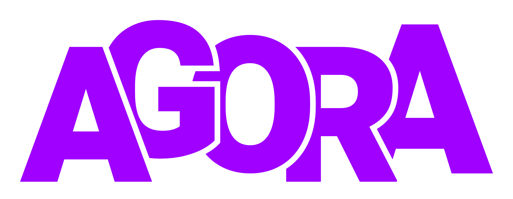

# Agora - full stack app

This project is for the Best Programming Practices - Server-Side Programming (BCDE224) course at Ara Institute of Canterbury. It is a full stack app built with PHP, designed to allow business to sign up and sell their homewares and plants to customers.

## Course Information

- **Course:** Best Programming Practices - Server-Side Programming – PHP (BCDE224)
- **Semester:** Two 2025
- **Assessment:** 2 & 3

## Project Overview

Agora is a B2C e-commerce platform for New Zealand specialising in curated items like Art, Vintage Goods, and Collectibles.
The website is designed around a seller hierarchy to maintain a professional marketplace: an individual must first register a Seller Account, and this account must be attached to a Business before any items can be listed.

## Key Features

- **Multi-Role Login:** Users can access the platform as a Buyer or Seller using the same email address.
- **Gated Selling:** Product listings are exclusively tied to a Business Account.
- **Dual Business Roles:** Within a Business, users are either a listing-focused Seller or a management-focused Administrator (cannot list products).
- **Central Data Integrity:** The database enforces that one Seller Account can only be associated with one Business at a time.
- **Catalogue Optimisation:** Products feature Tags for detailed search and dedicated fields for image versions (thumb_url, blur_url) to ensure fast loading speeds.

## Technologies Used

- **Frontend:** HTML5, CSS3, JavaScript
- **Backend:** PHP, MYSQL
- **Testing:** 

## Screenshots

*(Add screenshots here. Example:)*

- **Main Dashboard:**
  
- **Book Management:**
  
- **Borrowing a Book:**
  

## Entity Relationship Diagram

This diagram represents the database structure for Agora, showing the relationships between key entities:

## Assessment Tasks Covered

- Class diagram and model classes (User, Member, Librarian, Book, Catalogue, BorrowingRecord, Notification, Reservation)
- HTML and CSS structure for all LMS sections
- Core LMS functionality (user, book, borrowing, returning, search, notifications)
- Unit testing with Jasmine
- Code quality, comments, and documentation
